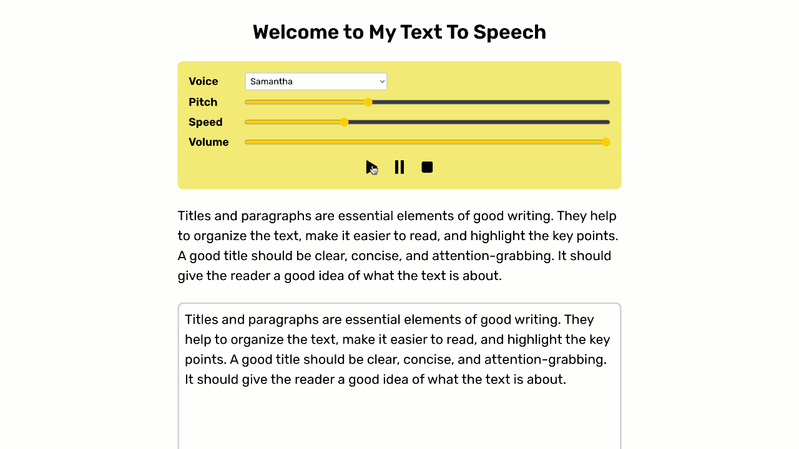

# Text to Speech with Highlight

This is an app to make speechSynthesis to read some text.
Change the text by inputting some text in form and click the Play button.

## Live Demo

[Live Demo Link](https://text-to-speech-with-highlight.vercel.app/)

## Built With

- Next.js
- TypeScript
- React
- JavaScript
- SCSS modules

## Table of Contents

- [Live Demo](#live-demo)
- [Built With](#built-with)
- [Author](#author)
- [Show your support](#show-your-support)
- [License](#license)
- [Acknowledgements](#acknowledgements)
- [Available Scripts](#available-scripts)

## Author

👤 **Yoko Saka**

- GitHub: [@yocosaka](https://github.com/yocosaka)
- LinkedIn: [LinkedIn](https://www.linkedin.com/in/yokosaka)

## Show your support

Give a ⭐️ if you like this project!

## 📝 License

This project is [MIT](./LICENSE) licensed.

## Acknowledgements

- [SpeechSynthesis](https://developer.mozilla.org/en-US/docs/Web/API/SpeechSynthesis)

## Available Scripts

In the project directory, you can run:

### `npm run dev`

Runs the app in the development mode.\
Open [http://localhost:3000](http://localhost:3000) to view it in the browser.

The page will reload if you make edits.\
You will also see any lint errors in the console.
